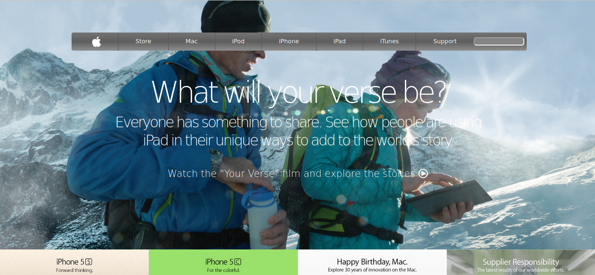

# Project Name

    This project consists of building a webpage using images as a background and adding gradients to elements.
    The goal is to make a clone of an old version of the Apple webpage for learning purpose.

    Additional description about the project and its features.

## Built With

    - Plain HTML5,
    - Pure CSS3,

## Live Demo

[Live Demo Link](https://rawcdn.githack.com/mcervantes71/Apple_Clone/7366809eacdeeaa36bc9cc409ccc191b507e47ab/index.html)

## Getting Started

    To get a local copy up and running follow these simple example steps.

### Install

    Download the repository

### Usage

    In any browser, open the index.html file

## Authors

👤 **Author1**

- Gmail: [Martin Cervantes](mailto:cervantes.martine@gmail.com)
- Github: [@mcervantes71](https://github.com/mcervantes71)
- Twitter: [@M4rt1nC3rv4nt3s](https://twitter.com/M4rt1nC3rv4nt3s)
- Linkedin: [Martin Cervantes](https://www.linkedin.com/in/cervantesmartin/)

## 🤝 Contributing

    Contributions, issues and feature requests are welcome!

Feel free to check the [issues page](../../issues).

## Show your support

    Give a ⭐️ if you like this project!

## 📝 License

This project is [MIT](lic.url) licensed.
