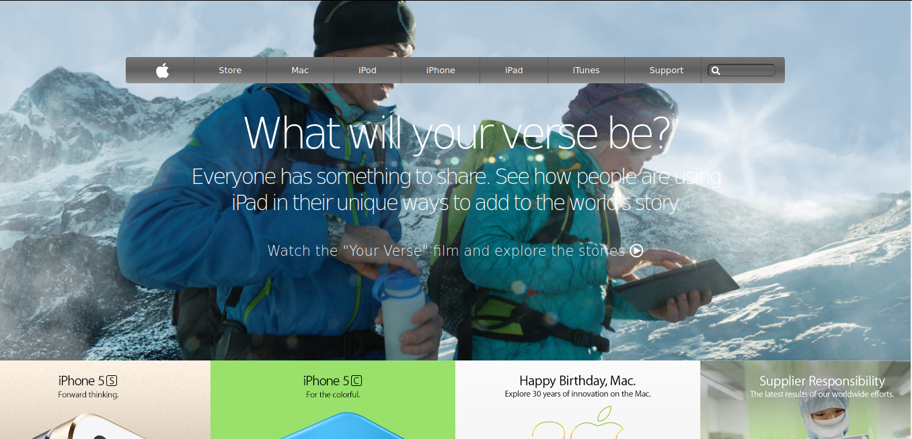

# Apple Clone

    This project consists of building a webpage using images as a background and adding gradients to elements.
    The goal is to make a clone of an old version of the Apple webpage for learning purpose.

## :package: Built With

    - Plain HTML5
    - Pure CSS3

## :mag: Live Demo

[Live Demo Link](https://mcervantes71.github.io/Apple_Clone/index.html)

## :computer: Getting Started

    To get a local copy up and running follow these simple steps.

### Install

    Download the repository.

### Usage

    In any browser, open the index.html file.

## :busts_in_silhouette: Authors

👤 **Author1**

- Gmail: [Martin Cervantes](mailto:cervantes.martine@gmail.com)
- Github: [@mcervantes71](https://github.com/mcervantes71)
- Twitter: [@M4rt1nC3rv4nt3s](https://twitter.com/M4rt1nC3rv4nt3s)
- Linkedin: [Martin Cervantes](https://www.linkedin.com/in/cervantesmartin/)

## 🤝 Contributing

    Contributions, issues and feature requests are welcome!

Feel free to check the [issues page](../../issues).

## :star2: Show your support

    Give a ⭐️ if you like this project!

## 📝 License

This project is [MIT](lic.url) licensed.
